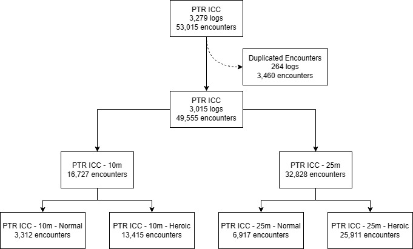

# ICC_PTR

Data on the first PTR session for The Icecrown Citadel (ICC)

## Graphic (1)

## Methodology

All the data was collected using the Warcraft Logs Classic API v2 and processed with R v.4.2 (R Development Core Team).

Icecrown Citadel (ICC) raids were located in this zone: https://classic.warcraftlogs.com/zone/reports?zone=1020

All wipes with Lich King at 10% or less HP were considered as kills; wipes at 0% were excluded.

Duplicated encounters were excluded based on: Average item level, duration of the encounter, difficulty, and mode.

The raw data file in data table ("Excel") format can be found in this repo: https://github.com/ForgeGit/ICC_PTR/blob/main/raw_data/ICC_PTR_clean_Data2023_09_03_h18_m38.csv

## Limitations

a.k.a. Things to consider when interpreting this as "information"

- Putricide numbers has been missing key mechanics from the encounter; as a result the number of wipes and kills are off potentially by a lot. 

- Not all logs are public. Given it is on the interest of some guilds to make their logs private on PTR due to the competitive nature of "progression" rewards (lumberjack rankings, in-game title, larping), this statistics are more biased towards a more casual playerbase. (I.E. less kills, more wipes, longer kill times).

- Not everyone has logs of their runs. Probably a minority, if you think most players are in a somewhat well-informed communities. Or it could be a great majority of players not logging their runs if you think most of the playerbase is "casual" and doesn't care about logging.

- PTR  means a portion of the players have either incomplete or scuffed UIs/macros/addons, making the overrall performance of the average player worse than what it actually is in live servers. Another group of the PTR players could also be testing specs and gear.

- Raids in general are mostly testing the content, sometimes wiping on purpose or doing quick pulls "just to see the boss". 

## Others

- The image used for the Open Graph Card comes from: https://www.zerochan.net/230963

## Other analysis and random stuff

- Check other things I have done here: https://github.com/ForgeGit?tab=repositories

