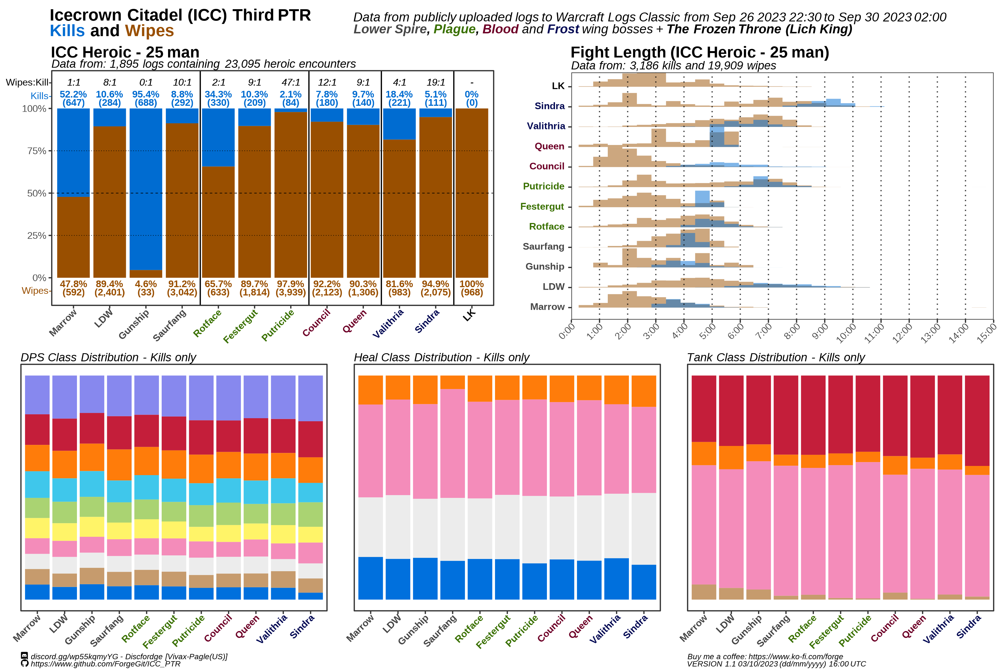

# ICC_PTR

PTR data for the raid "The Icecrown Citadel" (ICC) - World of Warcraft: Wrath of the Lich King Classic (2023) 

## 3rd round of PTR testing

## 2nd round of PTR testing

## 1st round of PTR testing

## Methodology

All the data was collected using the Warcraft Logs Classic API v2 and processed with R v.4.2 (R Development Core Team).

Icecrown Citadel (ICC) raids were located in this zone: https://classic.warcraftlogs.com/zone/reports?zone=1020

All wipes with Lich King at 10% or less HP were considered as kills; wipes at 0% were excluded.

Duplicated encounters were excluded based on: "Encounter Name", "Difficulty", "Size", "Kill/Wipe", "Boss %", "Fight Length", and "Avg. ilvl"

The raw data file in data table ("Excel") format can be found in this repo: https://github.com/ForgeGit/ICC_PTR/blob/main/raw_data/ICC_PTR_clean_Data_1stround_2023_09_21_h16_m11.csv

The file used for the graphics (which contains the same data as the link above), can be found in:  https://github.com/ForgeGit/ICC_PTR/blob/main/raw_data/viz/ICC_PTR_clean_Data_1stround_CORRECTED_2023_09_21_h16_m11.csv

## Limitations

a.k.a. Things to consider when interpreting this as "information"

- For the 1st round of PTR, Putricide was missing key mechanics from the encounter; as a result the number of wipes and kills are potentially off by a lot. 

- Similarly, Gunship has a couple kills wrongly flagged as "kills", which I haven't manually filtered.

- Heroic Lich King had some bugs which made it impossible to kill, allegedly.

General PTR limitations to consider:

- Not all logs are public. Given it is on the interest of some guilds to make their logs private on PTR due to the competitive nature of "progression" rewards (lumberjack rankings, in-game title, larping), this statistics are more biased towards a more casual playerbase. (I.E. less kills, more wipes, longer kill times).

- Not everyone has logs of their runs. Probably a minority, if you think most players are in a somewhat well-informed communities. Or it could be a great majority of players not logging their runs if you think most of the playerbase is "casual" and doesn't care about logging.

- PTR  means a portion of the players have either incomplete or scuffed UIs/macros/addons, making the overrall performance of the average player worse than what it actually is in live servers. Another group of the PTR players could also be testing specs and gear.

- Raids in general are mostly testing the content, sometimes wiping on purpose or doing quick pulls "just to see the boss". 

## Others

- The image used for the Open Graph Card comes from: https://www.zerochan.net/230963

## Other analysis and random stuff

- If you have questions, you can contact me on discord: https://discord.gg/wp55kqmyYG (Discord: Discfordge)

- Consider buying me a coffee? :) https://ko-fi.com/forge

- Check other things I have done here: https://github.com/ForgeGit?tab=repositories

## Changelog

- The data for the 1st round of PTR had some duplicated logs that were not "filtered" as explained in the Methodology section. I have adjusted the filter and this has resulted in less # of encounters. The change does not impact the overall results or interpretations of the graphic. The old version (Version 1) can now be found at: https://github.com/ForgeGit/ICC_PTR/tree/main/_img/old_v
